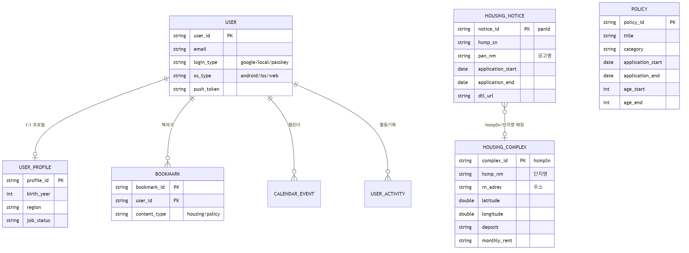

# 🚀 WISEYOUNG 슬기로운 청년생활 배포용 Backend Server

## 배포서버 DB Flow


## 🛠️ Tech Stack
- **Framework:** Spring Boot
- **Database:** MariaDB 
- **Infrastructure:** Cloudtype (배포 서버)
- **Push Notification:** Firebase Cloud Messaging 
- **External APIs:** - 공공데이터포털, 온통청년, LH 한국토지주택공사
  - KakaoMap API 
  - Google Gemini API 

## ✨ Core Features
* **공공데이터 자동 수집:** 주기적으로 청년 정책 및 주거 정보를 외부 공공 API로부터 수집하여 DB에 연동합니다.
* **사용자 맞춤형 정보 제공:** 클라이언트(Android)의 요청에 따라 필터링된 맞춤형 정보를 REST API 형태로 제공합니다.
* **스케줄링 기반 자동 푸시 알림:** 사용자의 설정 및 조건에 맞는 새로운 정책이 업데이트될 때 앱으로 알림을 전송합니다.

## API <-> DB Flow
## DB Structure ER


## Github Guidline 

| `feat` | 새로운 기능(Feature) 추가 | API, 비즈니스 로직, 스케줄러 등 **동작이 추가**될 때 |

| `fix` | 버그·에러 수정(Fix) | 잘못된 동작, 장애, 데이터 오류 등 **문제 해결** |

| `chore` | 빌드·인프라·설정 | 패키지, 환경 변수, 키 파일, Gradle 등 **기능과 무관한 유지보수** |

| `docs` | 문서(Documentation) | README, API 명세, 아키텍처 문서 등 |

| `refactor` | 구조 개선(Refactor) | **기능은 동일**, 코드 정리·분리·이름 변경 |

| `style` | 포맷·린트 | 세미콜론, import 정리 등 **로직 변경 없음** |

### WiseYoung 에서의 예시
#### feat — 새 기능
```
feat: 사용자별 정책 Top-K 추천 캐시 및 주간 sync 스케줄러 추가
```
#### fix — 버그 수정
```
fix: 동기화 시 이미 마감된 주택 공고가 다시 저장되던 문제 수정
```
#### chore — 설정 변경
```
chore: Firebase Admin SDK 인증 키 파일(JSON) 최신화
```
#### docs — 문서
```
docs: 정책 추천 Top-K 캐시 Before/After 아키텍처 문서 추가
```

#### refactor — 구조 개선 (기능 동일)
```
refactor: PolicyService 가중치 로직을 PolicyScoringService로 분리
```
