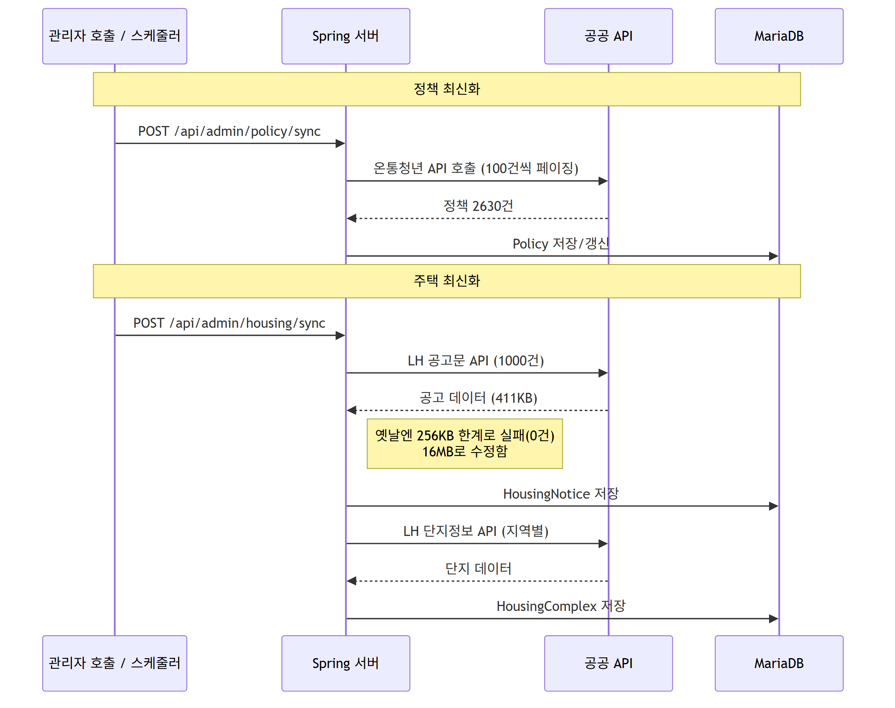

# 🚀 WISEYOUNG 슬기로운 청년생활 배포용 Backend Server

## 🏗️ System Architecture

## 🛠️ Tech Stack
- **Framework:** Spring Boot
- **Database:** MariaDB
- **Infrastructure:** Cloudtype (서버 및 DB 호스팅)
- **Push Notification:** Firebase Cloud Messaging (FCM)
- **External APIs:** - 공공데이터포털, 온통청년, LH 한국토지주택공사 (정책/주거 데이터 수집)
  - KakaoMap API (위치 기반 서비스)
  - Google Gemini API (AI 데이터 처리 및 분석)

## ✨ Core Features
* **공공데이터 자동 수집:** 주기적으로 청년 정책 및 주거 정보를 외부 공공 API로부터 수집하여 DB에 연동합니다.
* **사용자 맞춤형 정보 제공:** 클라이언트(Android)의 요청에 따라 필터링된 맞춤형 정보를 REST API 형태로 제공합니다.
* **스케줄링 기반 자동 푸시 알림:** 사용자의 설정 및 조건에 맞는 새로운 정책이 업데이트될 때 앱으로 알림을 전송합니다.
## API <-> DB Flow

## DATA 

## DB Structure ER

